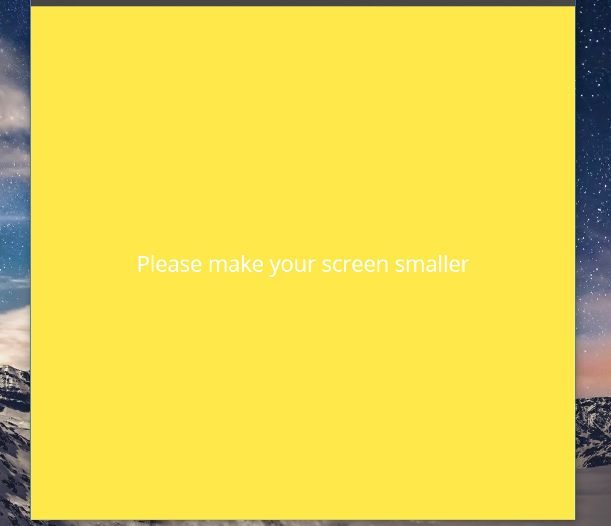

# kakao-clone

> Kakao Desktop App Clone

{: width="50px" height="50"}

## 개발 환경 설정

#### 주 사용언어, 운영체제 
  ### HTML, CSS
  ### Windows, Ubuntu

## 사이트

[Kakao-clone](https://choco0914.github.io/kakao-clone/) Click here!

### Kakao-clone 을 만들때 참조한 사이트

* [Nomard Coders](https://academy.nomadcoders.co/)
- HTML
* 회원가입, 로그인(google, github, kakao 게정으로 로그인가능), 회원탈퇴하기
* 회원가입을 하면 회원가입 축하 메일이 발송됩니다 :)
