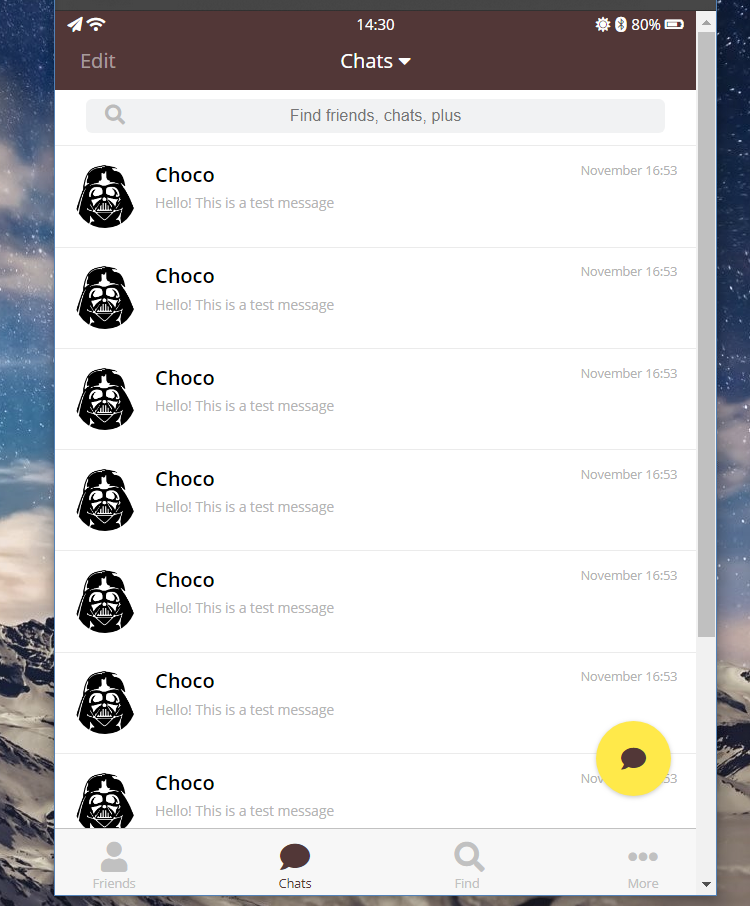

# kakao-clone

> Kakao Desktop App Clone

## 개발 환경 설정

#### 주 사용언어, 운영체제 
  ### HTML, CSS
  ### Windows, Ubuntu
#### 호스팅
  ### github를 이용해 무료로 호스팅

## 사이트

[Kakao-clone](https://choco0914.github.io/kakao-clone/) Click here!

## Kakao-clone 을 만들때 참조한 사이트

* [Nomard Coders](https://academy.nomadcoders.co/)

### HTML
- [Meta tags that google understands](https://support.google.com/webmasters/answer/79812?hl=en)
- [Official Meta Tags documentation](https://developer.mozilla.org/en/docs/Web/HTML/Element/meta)
- [Semantic Elements](https://www.w3schools.com/html/html5_semantic_elements.asp)
-

### CSS
- [Practice Flexbox](http://flexboxfroggy.com/#ko)
- [Official Transition Documentation](https://developer.mozilla.org/en/docs/Web/CSS/transition)
- [CSS Transform Documentation](https://developer.mozilla.org/en-US/docs/Web/CSS/transform)
- [Using media queries](https://developer.mozilla.org/en-US/docs/Web/CSS/Media_Queries/Using_media_queries)
- [Reset CSS](https://raw.githubusercontent.com/nomadcoders/kakao-clone/master/css/reset.css)
- [Box Sizing Border Box FTW!](https://www.paulirish.com/2012/box-sizing-border-box-ftw/)
- [A complete Guide to Flexbox](https://css-tricks.com/snippets/css/a-guide-to-flexbox/)
- [Box Shadow Official Documentation](https://developer.mozilla.org/en/docs/Web/CSS/box-shadow)
- [Official Background Position Official Documentation](https://developer.mozilla.org/en/docs/Web/CSS/background-position)
- [Cursor CSS Official Documentation](https://developer.mozilla.org/en/docs/Web/CSS/cursor)
- [Rgb() and Rgba() Official Documentation](https://developer.mozilla.org/en/docs/Web/CSS/color_value#rgb()_and_rgba())
- ['align-self' Official Documentation](https://developer.mozilla.org/en/docs/Web/CSS/align-self)
- [CSS3 Transition Timing Functions (ease-in-out)](http://css3.bradshawenterprises.com/transitions/)
- [Understanding z-index](https://developer.mozilla.org/en-US/docs/Web/CSS/CSS_Positioning/Understanding_z_index)

  ## BEM
    - [Introduction](http://getbem.com/introduction/)
    - [Key Concepts](https://en.bem.info/methodology/key-concepts/)
    - [Quick Start](https://en.bem.info/methodology/quick-start/)

 
 ### Editor
 - [Emmet documentation](https://docs.emmet.io/)
 
 ### Icon
 - [Fontawesome](https://fontawesome.com/)

